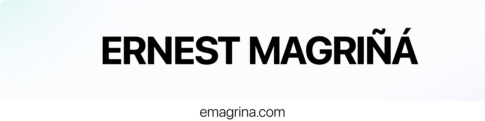

<link rel="stylesheet" href="https://use.fontawesome.com/releases/v5.15.3/css/all.css" integrity="sha384-DQN7KnA12m4ZV7i+FxRnLW9xu4lGOaS7lLxisYwNKpzcq3wqz6U7o+Mpvz9Xp3q+" crossorigin="anonymous">

# Hello! I'm Ernest Magriñá :wave:

I am a Frontend and DevOps developer, specialized in creating interactive web applications and implementing software infrastructures. My main focus is on developing attractive and functional user interfaces using technologies like React, Next.js, and Angular. Additionally, I have experience in implementing and managing cloud infrastructure platforms, using tools such as Kubernetes, Docker, Jenkins, and Grafana. While I also have some basic knowledge in Backend, my main focus is on creating exceptional user experiences and optimizing development and deployment processes.

<!-- Actualmente trabajo como [título del trabajo] en [nombre de la empresa]. -->

## My Skills

	
| **Frontend** | **Backend** | **DevOps** |
|--------------|-------------|------------|
|  |  |  |

	
## GitHub Stats and Most Used Languages

  
  

## Do you want to collaborate on a project?
If you're looking for a Frontend or DevOps developer to collaborate on a project, 
I'm interested in working on exciting projects. If you have a project you think 
I could be useful for, don't hesitate to contact me. I'm available for both 
full-time and part-time work. You can find more information about me on my 
<a href="https://emagrina.com" target="_blank">personal website</a> or on my <a href="https://www.linkedin.com/in/emagrina/" target="_blank"><i class="fab fa-linkedin-in"></i> LinkedIn profile</a>. 

<a href="https://emagrina.com/contact" target="_blank">💌 Let's talk!</a>

